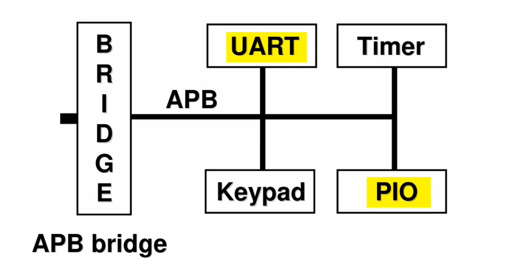
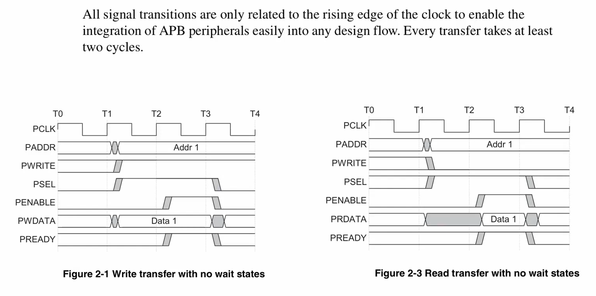
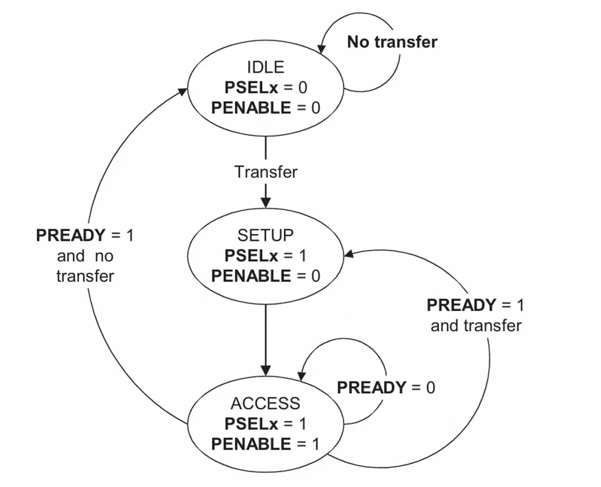
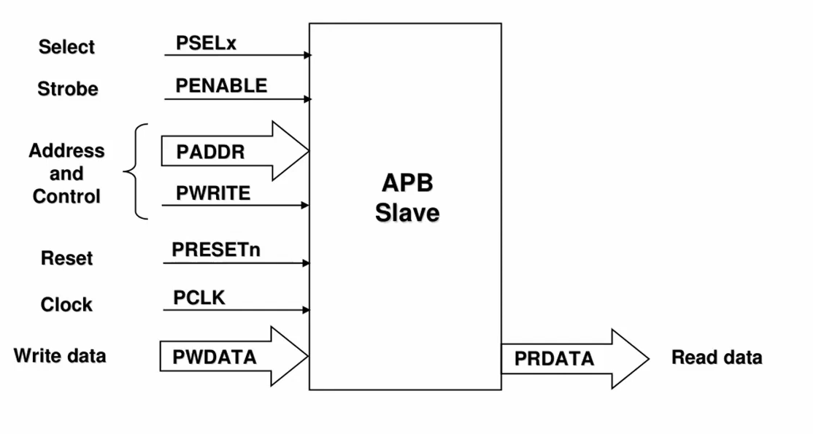
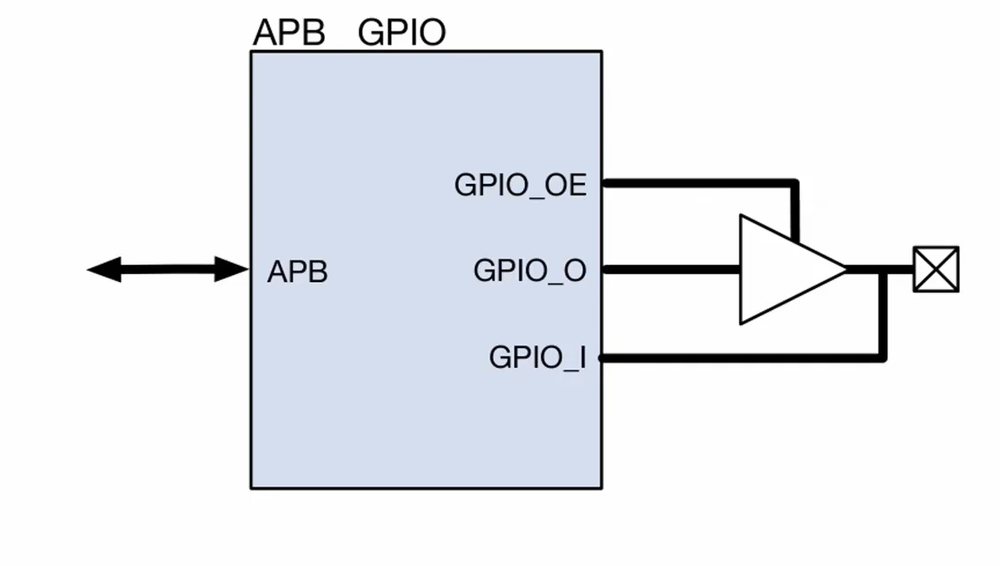
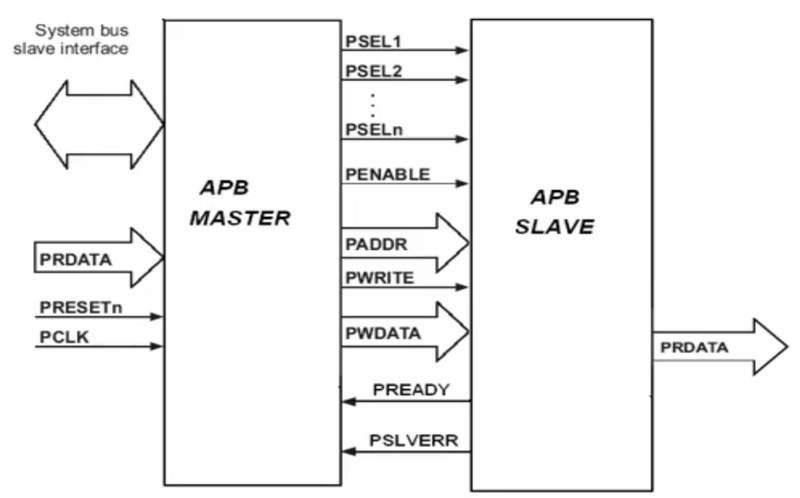
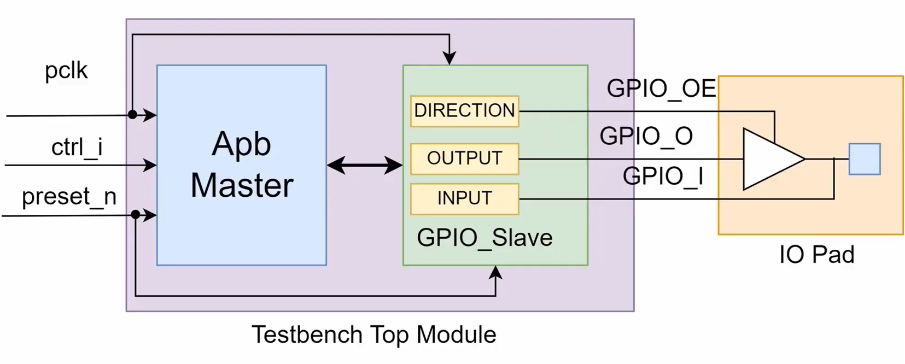
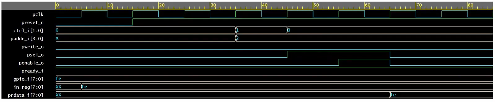
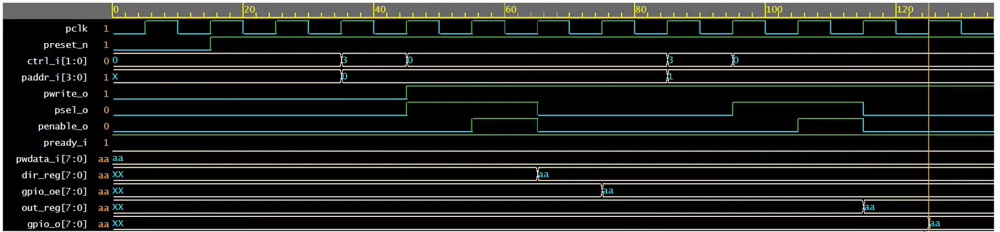

# GPIO Implementation for Advanced Microcontroller Bus (AMBA) using System Verilog
## This repository hosts the source code and test bench for the implementation of a General Purpose Input/Output (GPIO) module compliant with the Advanced Microcontroller Bus architecture (AMBA) standard, developed using System Verilog.

## Timing Diagram

## State Machine

## Block Diagrams

## Read Transaction

## Write Transaction

